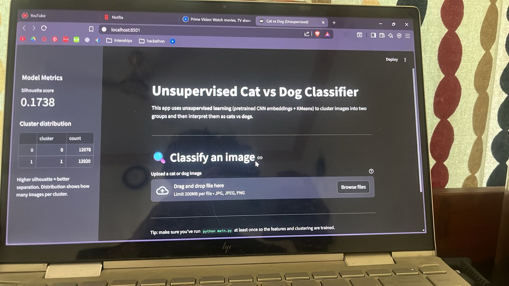
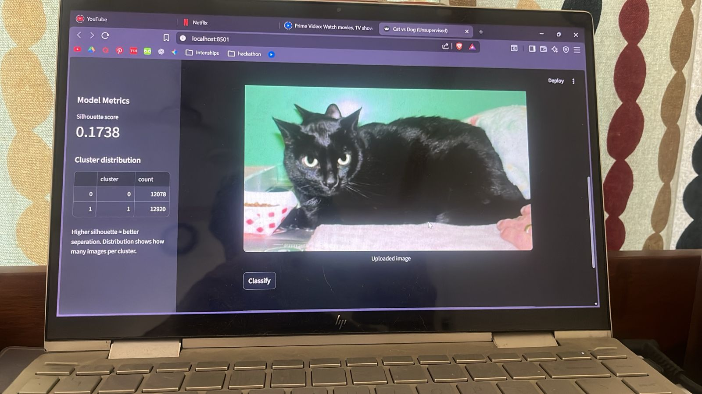
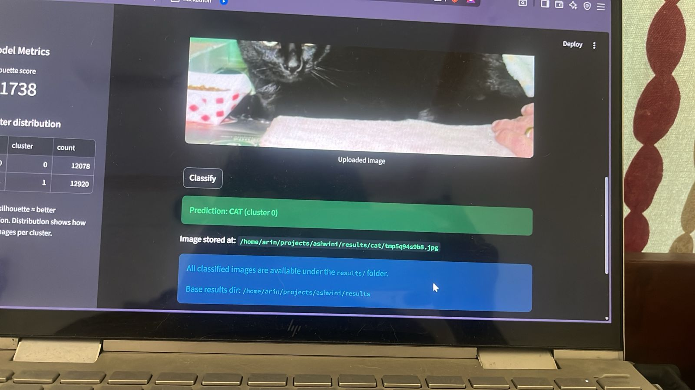

# 🐱🐶 Unsupervised Cat vs Dog Classifier  
### ResNet50 Embeddings + PCA + KMeans + Streamlit UI

This project performs **unsupervised learning** to separate cat vs dog images without any labeled dataset.  
It uses:

- Pretrained **ResNet50** for feature extraction  
- **PCA** for dimensionality reduction  
- **KMeans** for clustering  
- Cluster inspection to assign meaning (cat / dog)  
- A **Streamlit** web app for real-time prediction  

---

## 📸 Output Screenshots

### Prediction Output  

### Full Classification View  

### App Home + Metrics  

---

## 📁 Project Structure

